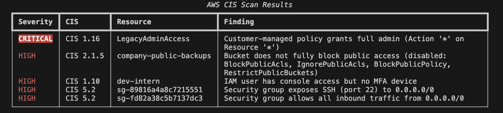
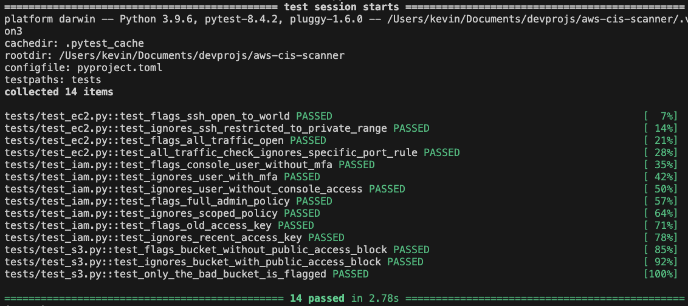

# AWS CIS Scanner

> Scans an AWS account for security misconfigurations against CIS Benchmark
> controls, reporting severity-rated findings with remediation guidance.




Cloud misconfiguration — public storage, over-permissive identity, and open
network ingress — is one of the most common causes of real-world breaches. This
tool audits an account for that class of issue across S3, IAM, and EC2, maps
each finding to a CIS control, and rates it by severity.

## Features

- **S3** — buckets without Block Public Access (CIS 2.1.5)
- **IAM** — console users without MFA (CIS 1.10), customer-managed policies
  granting full `*:*` admin (CIS 1.16), and access keys older than 90 days
  (CIS 1.14)
- **EC2** — security groups exposing SSH/RDP to `0.0.0.0/0` (CIS 5.2) and groups
  allowing all inbound traffic (CIS 5.2)
- Output as a color-coded table or JSON
- Fully tested against mocked AWS — **no real account or credentials required**

## Checks

| Check | Service | CIS Control | Severity |
|-------|---------|-------------|----------|
| Public access block missing/disabled | S3 | 2.1.5 | HIGH |
| Console user without MFA | IAM | 1.10 | HIGH |
| Full-admin (`*:*`) managed policy | IAM | 1.16 | CRITICAL |
| Access key older than 90 days | IAM | 1.14 | MEDIUM |
| SSH/RDP open to `0.0.0.0/0` | EC2 | 5.2 | HIGH |
| All traffic open to `0.0.0.0/0` | EC2 | 5.2 | HIGH |

## Quick start

Try it with zero setup. The demo spins up an in-memory AWS account seeded with
insecure resources and scans it — no AWS account or credentials needed:

```bash
pip install -r requirements.txt
python -m scanner.cli --demo
```

Or with Docker:

```bash
docker build -t aws-cis-scanner .
docker run --rm aws-cis-scanner
```

### Scanning a real account

Configure AWS credentials (a read-only `SecurityAudit` policy is sufficient),
then:

```bash
python -m scanner.cli --profile my-profile --region us-east-1
python -m scanner.cli --output json      # machine-readable output
```

The process exits non-zero when any finding is present, so it can gate a CI
pipeline.

## Sample output

```json
[
  {
    "check_id": "iam_full_admin_policy",
    "title": "Customer-managed policy grants full admin (Action '*' on Resource '*')",
    "cis_control": "CIS 1.16",
    "severity": "CRITICAL",
    "resource": "LegacyAdminAccess",
    "remediation": "Scope the policy to specific actions and resources; never allow '*' on both.",
    "status": "FAIL"
  }
]
```

## Testing

Every check is covered by tests that assert it flags an insecure resource **and**
leaves a correctly-configured one alone. Tests run entirely against `moto`'s
in-memory AWS, so no account or credentials are required:

```bash
pytest -v
```



## How it works

Each check is a small function that takes a boto3 session and returns a list of
`Finding` objects. Checks register themselves with a decorator, so the CLI
discovers and runs them without any hardcoding — adding a new check means adding
one function, not editing the engine. The reporter formats findings as a table
or JSON, and demo mode reuses the same test-time AWS mock to run the whole
pipeline credential-free.

```
scanner/
  models.py     # Finding dataclass + Severity enum
  registry.py   # @register decorator, run_all()
  report.py     # table / JSON output
  cli.py        # command-line entry point
  demo.py       # seeds a mock account for --demo
  checks/       # one module per service: s3, iam, ec2
tests/          # mirrors checks/ — one insecure + one secure case each
```

## Roadmap

- Root-account checks (MFA on root, no root access keys) via the credential report
- IPv6 (`::/0`) ingress detection
- Additional services (public RDS snapshots, unencrypted EBS volumes)
- HTML report output
- GitHub Actions workflow to run the checks in CI

## Limitations

- Covers a focused set of high-signal checks, not the full CIS benchmark.
- Security-group checks currently match IPv4 `0.0.0.0/0` only.

## License

MIT